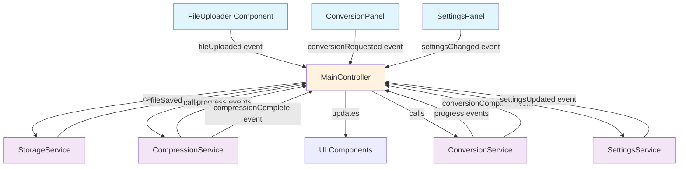

# Event-Driven, Service-Centric Architecture

## Core Philosophy

**DEPRECATED:** The old "compression-monolithic" architecture where the CompressionService was the main component and components directly called each other's methods.

**NEW STANDARD:** The application is a platform of independent, modular services. The UI is a thin layer that orchestrates these services via events. The File Uploader is a generic component, and no single service is the 'main' service.

## Architectural Vision

This application follows an **event-driven, service-centric architecture** where:

- **Components are isolated** and communicate only through events
- **Services contain all business logic** and expose standardized APIs
- **The UI layer orchestrates** services but contains no business logic
- **Events flow unidirectionally** from components to controllers to services and back

## Data Flow Architecture



## Key Principles

### 1. Decoupled Components
- **RULE**: Components must not contain business logic or directly call methods from other components
- **IMPLEMENTATION**: Components emit events and listen for state changes
- **EXAMPLE**: FileUploader emits `fileUploaded` event instead of calling CompressionService directly

### 2. Service-Centric Workflow
- **RULE**: All business logic (compression, conversion, etc.) must reside in service modules within the `/services` directory
- **IMPLEMENTATION**: Services expose standardized APIs and emit progress/status/complete events
- **EXAMPLE**: `CompressionService.compress(file)` emits `compressionProgress` and `compressionComplete` events

### 3. Event-Driven Communication
- **RULE**: Inter-component communication happens exclusively through events
- **IMPLEMENTATION**: Components emit events, MainController listens and orchestrates
- **EXAMPLE**: `this.dispatchEvent(new CustomEvent('progress', { detail: { percentage: 85 } }))`

### 4. Unidirectional Data Flow
- **RULE**: Data flows from components → controller → services → controller → UI updates
- **IMPLEMENTATION**: No circular dependencies or direct component-to-component communication
- **EXAMPLE**: FileUploader → MainController → StorageService → MainController → UI update

### 5. Single Responsibility Services
- **RULE**: Each service has one clear responsibility and standardized interface
- **IMPLEMENTATION**: StorageService handles files, CompressionService handles compression, etc.
- **EXAMPLE**: StorageService API: `saveFile(id, blob, metadata)`, `getFile(id)`, `getAllFiles()`

## Component Hierarchy

```
MainController (Event Orchestrator)
├── FileUploader (Generic file input widget)
├── CompressionInterface (Compression UI controls)
├── ConversionPanel (Conversion UI controls)
├── SettingsPanel (Settings UI controls)
├── FileManager (File list and management)
└── ResultsDisplay (Processing results)

Services Layer (Business Logic)
├── StorageService (File storage and retrieval)
├── CompressionService (PDF compression logic)
├── ConversionService (Document conversion logic)
├── OCRService (Text extraction logic)
├── AIService (AI-powered features)
└── AnalyticsService (Usage tracking)
```

## Migration from Old Architecture

### What Changed

**OLD WAY (Deprecated)**:
- CompressionService was the main component
- Components directly called each other's methods
- Business logic scattered across components
- Tight coupling between UI and business logic

**NEW WAY (Standard)**:
- MainController orchestrates all interactions
- Components are isolated and event-driven
- All business logic centralized in services
- Loose coupling through standardized events

### Migration Rules

1. **Component Isolation**: Remove all direct method calls between components
2. **Event Implementation**: Replace method calls with event emission/listening
3. **Service Extraction**: Move business logic from components to services
4. **Controller Pattern**: Route all interactions through MainController

## Service Interface Standards

All services must implement this standard interface:

```javascript
class StandardService extends EventTarget {
    constructor() {
        super();
        this.isInitialized = false;
    }
    
    async init() {
        // Service initialization
        this.isInitialized = true;
        this.dispatchEvent(new CustomEvent('serviceReady'));
    }
    
    // Standard event emission pattern
    emitProgress(percentage, message) {
        this.dispatchEvent(new CustomEvent('progress', {
            detail: { percentage, message, timestamp: Date.now() }
        }));
    }
    
    emitComplete(result) {
        this.dispatchEvent(new CustomEvent('complete', {
            detail: { result, timestamp: Date.now() }
        }));
    }
    
    emitError(error) {
        this.dispatchEvent(new CustomEvent('error', {
            detail: { error, timestamp: Date.now() }
        }));
    }
}
```

## Event Naming Conventions

### Component Events (Outbound)
- `fileUploaded` - File selected/dropped
- `compressionRequested` - User requests compression
- `conversionRequested` - User requests conversion
- `settingsChanged` - User changes settings

### Service Events (Outbound)
- `progress` - Operation progress update
- `complete` - Operation completed successfully
- `error` - Operation failed
- `statusChanged` - Service status change

### Controller Events (Internal)
- `serviceCall` - Controller calling service
- `uiUpdate` - Controller updating UI
- `stateChange` - Application state change

## Implementation Guidelines

### 1. Component Development
```javascript
// CORRECT: Event-driven component
class FileUploader extends BaseComponent {
    handleFileSelection(files) {
        // Validate files locally
        const validFiles = this.validateFiles(files);
        
        // Emit event (no direct service calls)
        this.dispatchEvent(new CustomEvent('fileUploaded', {
            detail: { files: validFiles }
        }));
    }
}

// INCORRECT: Direct service calls
class FileUploader extends BaseComponent {
    handleFileSelection(files) {
        // DON'T DO THIS - no direct service calls
        this.storageService.saveFiles(files);
        this.compressionService.compress(files);
    }
}
```

### 2. Service Development
```javascript
// CORRECT: Service with event emission
class CompressionService extends StandardService {
    async compress(file, settings) {
        this.emitProgress(0, 'Starting compression...');
        
        try {
            const result = await this.performCompression(file, settings);
            this.emitProgress(100, 'Compression complete');
            this.emitComplete(result);
            return result;
        } catch (error) {
            this.emitError(error);
            throw error;
        }
    }
}
```

### 3. Controller Implementation
```javascript
// MainController orchestrates everything
class MainController extends EventTarget {
    constructor() {
        super();
        this.services = new Map();
        this.components = new Map();
        this.setupEventListeners();
    }
    
    setupEventListeners() {
        // Listen to component events
        document.addEventListener('fileUploaded', this.handleFileUploaded.bind(this));
        document.addEventListener('compressionRequested', this.handleCompressionRequested.bind(this));
    }
    
    async handleFileUploaded(event) {
        const { files } = event.detail;
        
        // Call storage service
        const storageService = this.services.get('storage');
        await storageService.saveFiles(files);
        
        // Update UI
        this.updateFileList();
    }
}
```

## Benefits of This Architecture

1. **Maintainability**: Clear separation of concerns makes code easier to maintain
2. **Testability**: Isolated components and services are easier to test
3. **Scalability**: New features can be added without affecting existing code
4. **Reusability**: Generic components can be reused across different contexts
5. **Debugging**: Event-driven flow makes it easier to trace issues

## Next Steps

1. **Audit existing code** against these architectural principles
2. **Identify violations** of component isolation and service-centric rules
3. **Create migration plan** to refactor existing code
4. **Implement MainController** as the central event orchestrator
5. **Standardize service interfaces** according to the specification

This architecture ensures the application remains maintainable, scalable, and follows modern best practices for JavaScript applications.